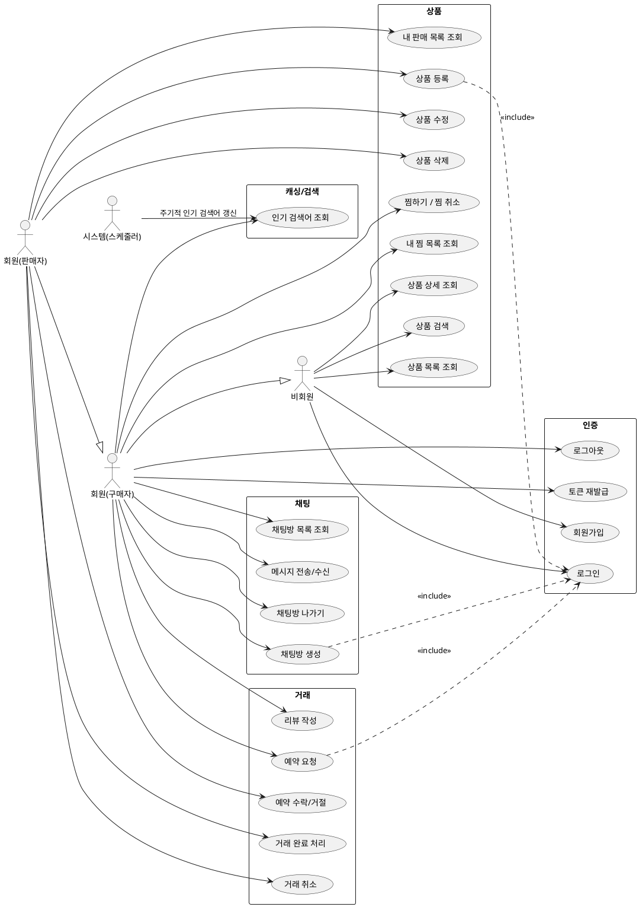
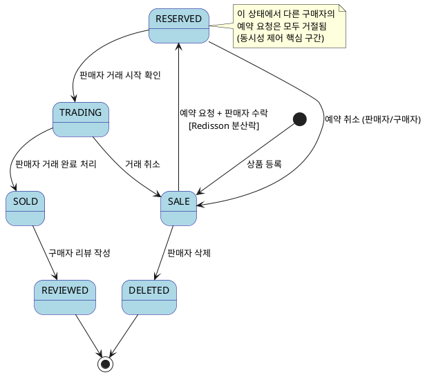

# 03. 유스케이스 명세서

> **버전**: v1.0

---

## 1. 유스케이스 다이어그램 (PlantUML)

---

## 2. 유스케이스 명세

### UC01. 회원가입

| 항목 | 내용 |
|------|------|
| 액터 | 비회원 |
| 사전 조건 | 이메일이 중복되지 않아야 함 |
| 기본 흐름 | 1. 이메일, 비밀번호, 닉네임 입력 → 2. 이메일 중복 확인 → 3. 비밀번호 해시(BCrypt) → 4. 회원 저장 → 5. 성공 응답 |
| 예외 흐름 | E1. 이메일 중복 → 409 Conflict 반환 |
| 사후 조건 | 회원 레코드 생성, 로그인 가능 상태 |

---

### UC02. 로그인

| 항목 | 내용 |
|------|------|
| 액터 | 비회원 |
| 사전 조건 | 가입된 이메일 |
| 기본 흐름 | 1. 이메일/비밀번호 입력 → 2. BCrypt 비교 → 3. AccessToken(15분) + RefreshToken(7일) 발급 → 4. RefreshToken Redis 저장 |
| 예외 흐름 | E1. 비밀번호 불일치 → 401 Unauthorized |
| 사후 조건 | JWT 쌍 반환 |

---

### UC04. 토큰 재발급

| 항목 | 내용 |
|------|------|
| 액터 | 회원 |
| 사전 조건 | 유효한 RefreshToken 보유 |
| 기본 흐름 | 1. RefreshToken 전송 → 2. Redis에서 검증 → 3. 새 AccessToken 발급 |
| 예외 흐름 | E1. RefreshToken 만료/불일치 → 401, 재로그인 유도 |

---

### UC12. 상품 검색

| 항목 | 내용 |
|------|------|
| 액터 | 비회원, 회원 |
| 사전 조건 | 없음 |
| 기본 흐름 | 1. 키워드 + 카테고리 필터 입력 → 2. 검색어 기록(비동기) → 3. QueryDSL 동적 쿼리 실행 → 4. 결과 반환 |
| 캐싱 | 인기 검색어는 Caffeine(TTL 10분) 제공 |
| 사후 조건 | 검색어 카운트 증가 (인기 검색어 집계용) |

---

### UC13. 상품 등록

| 항목 | 내용 |
|------|------|
| 액터 | 회원(판매자) |
| 사전 조건 | 로그인 상태 |
| 기본 흐름 | 1. 제목/설명/가격/카테고리/이미지 입력 → 2. 이미지 업로드 → 3. 상품 저장 (초기 상태: SALE) |
| 제약 | 이미지 최대 10장, 제목 2~40자, 가격 100~99,999,999원 |

---

### UC20. 예약 요청 ⭐ (동시성 제어 핵심)

| 항목 | 내용 |
|------|------|
| 액터 | 회원(구매자) |
| 사전 조건 | 상품 상태 = SALE, 본인 상품 아님 |
| 기본 흐름 | 1. 예약 요청 → 2. Redisson 분산락 획득 시도 → 3. 상품 상태 재확인 (비관적 락) → 4. 상태 RESERVED로 변경 → 5. 채팅방 자동 생성 → 6. 락 해제 |
| 예외 흐름 | E1. 락 획득 실패(이미 예약됨) → 409 반환 |
| 사후 조건 | 상품 상태 = RESERVED, 채팅방 생성 |

---

### UC22. 거래 완료 처리

| 항목 | 내용 |
|------|------|
| 액터 | 회원(판매자) |
| 사전 조건 | 상품 상태 = TRADING |
| 기본 흐름 | 1. 거래 완료 버튼 클릭 → 2. 상태 SOLD로 변경 → 3. 구매자에게 리뷰 요청 알림 |
| 사후 조건 | 상품 상태 = SOLD, 리뷰 작성 가능 |

---

### UC24. 리뷰 작성

| 항목 | 내용 |
|------|------|
| 액터 | 회원(구매자) |
| 사전 조건 | 상품 상태 = SOLD, 해당 거래의 구매자 |
| 기본 흐름 | 1. 별점(1~5) + 내용 입력 → 2. 리뷰 저장 → 3. 판매자 평점 갱신 |
| 제약 | 거래 1건당 리뷰 1개, 작성 후 수정 불가 |

---

### UC32. 메시지 전송/수신 (WebSocket)

| 항목 | 내용 |
|------|------|
| 액터 | 회원 |
| 사전 조건 | 채팅방 참여자, WebSocket 연결 상태 |
| 기본 흐름 | 1. STOMP SEND → 2. 서버에서 메시지 저장 (MySQL) → 3. STOMP SUBSCRIBE 채널로 브로드캐스트 |
| 예외 흐름 | E1. 연결 끊김 → 재연결 시 미수신 메시지 REST API로 조회 |

---

## 3. 거래 상태 전이 다이어그램 (PlantUML)

