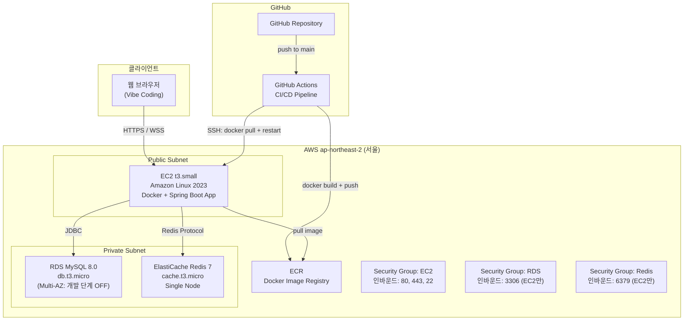
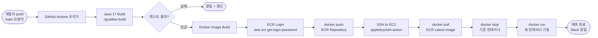

# 08. 인프라 아키텍처 다이어그램

> **버전**: v1.0

---

## 1. 전체 아키텍처



---

## 2. CI/CD 파이프라인 상세



---

## 3. EC2 Docker Compose 구성

```yaml
# docker-compose.yml (EC2에서 실행)
version: '3.8'
services:
  app:
    image: {AWS_ACCOUNT_ID}.dkr.ecr.ap-northeast-2.amazonaws.com/marketplace:latest
    ports:
      - "8080:8080"
    environment:
      - SPRING_PROFILES_ACTIVE=prod
      - DB_URL=${DB_URL}           # Secrets Manager or .env
      - DB_USERNAME=${DB_USERNAME}
      - DB_PASSWORD=${DB_PASSWORD}
      - REDIS_HOST=${REDIS_HOST}
      - JWT_SECRET=${JWT_SECRET}
    restart: unless-stopped
    healthcheck:
      test: ["CMD", "curl", "-f", "http://localhost:8080/actuator/health"]
      interval: 30s
      timeout: 10s
      retries: 3
```

---

## 4. GitHub Actions Workflow 구조

```yaml
# .github/workflows/deploy.yml
name: Deploy to AWS EC2

on:
  push:
    branches: [ main ]

jobs:
  build-and-deploy:
    runs-on: ubuntu-latest
    steps:
      - uses: actions/checkout@v3

      - name: Set up JDK 17
        uses: actions/setup-java@v3
        with:
          java-version: '17'
          distribution: 'temurin'

      - name: Build with Gradle
        run: ./gradlew build -x test

      - name: Configure AWS credentials
        uses: aws-actions/configure-aws-credentials@v2
        with:
          aws-access-key-id: ${{ secrets.AWS_ACCESS_KEY_ID }}
          aws-secret-access-key: ${{ secrets.AWS_SECRET_ACCESS_KEY }}
          aws-region: ap-northeast-2

      - name: Login to Amazon ECR
        uses: aws-actions/amazon-ecr-login@v1

      - name: Build and Push Docker image
        run: |
          docker build -t $ECR_REGISTRY/$ECR_REPOSITORY:latest .
          docker push $ECR_REGISTRY/$ECR_REPOSITORY:latest

      - name: Deploy to EC2
        uses: appleboy/ssh-action@master
        with:
          host: ${{ secrets.EC2_HOST }}
          username: ec2-user
          key: ${{ secrets.EC2_SSH_KEY }}
          script: |
            aws ecr get-login-password --region ap-northeast-2 | \
              docker login --username AWS --password-stdin $ECR_REGISTRY
            docker pull $ECR_REGISTRY/$ECR_REPOSITORY:latest
            docker-compose down
            docker-compose up -d
```

---

## 5. 보안 그룹 규칙

| 대상 | 인바운드 | 소스 |
|------|----------|------|
| EC2 | 80 (HTTP) | 0.0.0.0/0 |
| EC2 | 443 (HTTPS) | 0.0.0.0/0 |
| EC2 | 22 (SSH) | 개발자 IP 고정 |
| RDS | 3306 | EC2 SG |
| ElastiCache | 6379 | EC2 SG |

---

## 6. 환경 구분

| 환경 | 구성 | 비고 |
|------|------|------|
| local | H2 인메모리 + Local Redis | 개발용 |
| dev | EC2 + RDS + ElastiCache | 개발 서버 (선택) |
| prod | EC2 + RDS + ElastiCache | 배포 서버 |

**Spring Profile 전략**:
```
application.yml          # 공통 설정
application-local.yml    # H2, Redis localhost
application-prod.yml     # RDS, ElastiCache 주소 (환경변수 참조)
```

---

## 7. 비용 추정 (월, USD)

| 서비스 | 스펙 | 예상 비용 |
|--------|------|-----------|
| EC2 t3.small | 2 vCPU, 2GB | ~$17 |
| RDS db.t3.micro | MySQL 8, 20GB | ~$15 |
| ElastiCache t3.micro | Redis, 0.5GB | ~$12 |
| ECR | 스토리지 1GB 이하 | ~$1 |
| **합계** | | **~$45/월** |

> 프리티어 사용 시 EC2, RDS 첫 12개월 무료 혜택 적용 가능