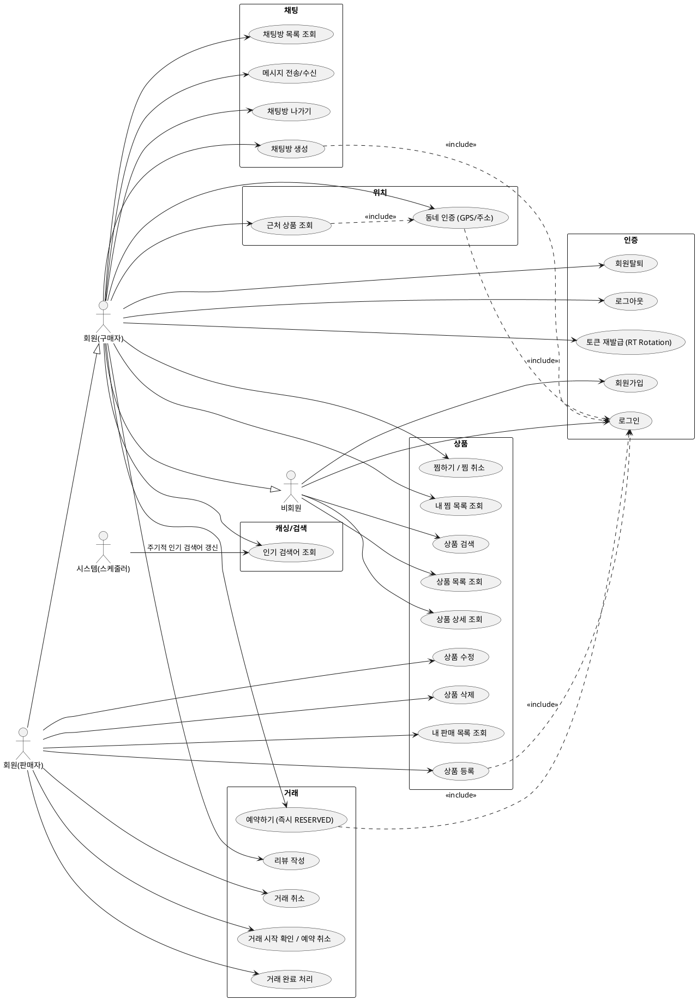
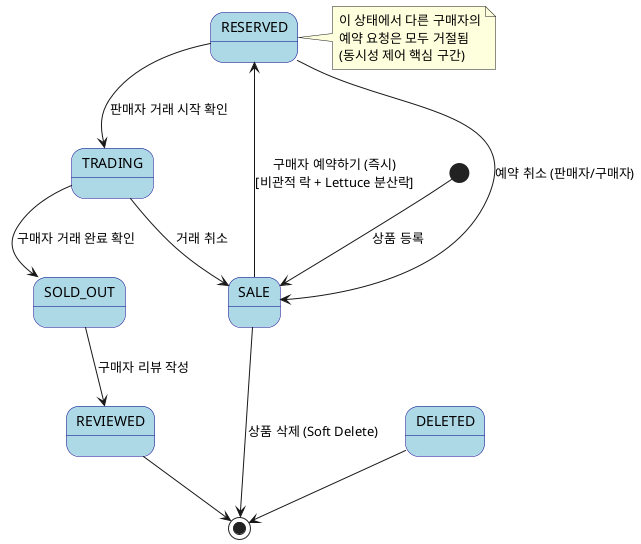

# 03. 유스케이스 명세서

> **버전**: v1.5 (UC41·UC42 추가 — 동네 인증·근처 상품 조회 / UC33 실제 구현 반영, Lettuce 분산락, Redis ZSET 인기검색어 반영)

---

## 1. 유스케이스 다이어그램 (PlantUML)

---

## 2. 유스케이스 명세

### UC01. 회원가입

| 항목 | 내용 |
|------|------|
| 액터 | 비회원 |
| 사전 조건 | 이메일 및 닉네임이 중복되지 않아야 함 |
| 기본 흐름 | 1. 이메일, 비밀번호, 닉네임, 프로필 이미지 입력 → 2. 닉네임 중복 확인 (Lettuce SETNX 락) → 3. 이메일 중복 확인 → 4. 비밀번호 해시(BCrypt) → 5. 회원 저장 → 6. 성공 응답 |
| 예외 흐름 | E1. 닉네임 중복 → 409 Conflict 반환 / E2. 이메일 중복 → 409 Conflict 반환 |
| 사후 조건 | 회원 레코드 생성, 로그인 가능 상태 |

---

### UC02. 로그인

| 항목 | 내용 |
|------|------|
| 액터 | 비회원 |
| 사전 조건 | 가입된 이메일 |
| 기본 흐름 | 1. 이메일/비밀번호 입력 → 2. BCrypt 비교 → 3. AccessToken(15분) 및 RefreshToken(7일) 발급 → 4. RT Redis 저장 |
| 예외 흐름 | E1. 비밀번호 불일치 → 401 Unauthorized / E2. 존재하지 않는 회원 → 404 Not Found |
| 사후 조건 | AccessToken, RefreshToken 반환 |

---

### UC12. 상품 검색

| 항목 | 내용 |
|------|------|
| 액터 | 비회원, 회원 |
| 사전 조건 | 없음 |
| 기본 흐름 | 1. 키워드 + 카테고리 필터 입력 → 2. Redis ZSET 스코어 증가 (`ZINCRBY`) → 3. QueryDSL 동적 쿼리 실행 → 4. 결과 반환 |
| 캐싱 | 인기 검색어는 Redis ZSET(실시간) 제공 |
| 사후 조건 | Redis 내 키워드 스코어 상승 |

---

### UC13. 상품 등록

| 항목 | 내용 |
|------|------|
| 액터 | 회원(판매자) |
| 사전 조건 | 로그인 상태 |
| 기본 흐름 | 1. 제목/설명/가격/카테고리/이미지 입력 → 2. 이미지 업로드 → 3. 상품 저장 (초기 상태: SALE) |
| 제약 | 이미지 최대 10장, 제목 2~40자, 가격 100~99,999,999원 |

---

### UC20. 예약 요청 ⭐ (동시성 제어 핵심)

| 항목 | 내용 |
|------|------|
| 액터 | 회원(구매자) |
| 사전 조건 | 상품 상태 = SALE, 본인 상품 아님, 로그인 상태 |
| 기본 흐름 | 1. [예약하기] 클릭 → 2. Lettuce SETNX 분산락 시도 (waitTime=0, leaseTime=3s) → 3. status=SALE 확인 + 활성 TRADE 없음 확인 → 4. PRODUCT.status = RESERVED → 5. TRADE 생성 → 6. 락 해제 → 7. 200 반환 |
| 예외 흐름 | E1. 락 획득 실패 → 409 `ALREADY_RESERVED` (retryAfter: 1) / E2. 본인 상품 → 400 `SELF_RESERVATION` / E3. DB 락 타임아웃 → 409 `LOCK_TIMEOUT` |
| 사후 조건 | PRODUCT.status = RESERVED, TRADE 생성 (status=RESERVED) |
| 설계 결정 | **판매자 승인 없음 — 즉시 RESERVED**. Lettuce 분산락 + 비관적 락(Fallback) 이중화로 정합성 보장. |

---

### UC22. 거래 완료 확인

| 항목 | 내용 |
|------|------|
| 액터 | 회원(구매자) |
| 사전 조건 | TRADE.status = TRADING, 해당 거래의 구매자 |
| 기본 흐름 | 1. [거래 완료 확인] 버튼 클릭 → 2. `PATCH /trades/{id}/status { status: "SOLD" }` → 3. TRADE.status = SOLD, PRODUCT.status = SOLD_OUT → 4. 200 반환 |
| 사후 조건 | TRADE.status = SOLD, PRODUCT.status = SOLD_OUT. 리뷰 작성 버튼 활성화 |
| 설계 결정 | **구매자가 완료 확인** — 판매자가 일방적으로 완료 처리하는 것을 방지. 직거래 후 구매자가 수령 확인 버튼을 눌러야 SOLD로 전이 |

---

### UC24. 리뷰 작성

| 항목 | 내용 |
|------|------|
| 액터 | 회원(구매자) |
| 사전 조건 | 상품 상태 = SOLD, 해당 거래의 구매자 |
| 기본 흐름 | 1. 별점(0.5~5.0) + 내용 입력 → 2. 리뷰 저장 → 3. 판매자 평점 갱신 (비관적 락으로 Lost Update 방지) → 4. TRADE.status = REVIEWED 전이 |
| 제약 | 거래 1건당 리뷰 1개, 작성 후 수정 불가, 내용 최대 500자 |

---

### UC32. 메시지 전송/수신 (WebSocket)

| 항목 | 내용 |
|------|------|
| 액터 | 회원 |
| 사전 조건 | 채팅방 참여자, WebSocket 연결 상태 |
| 기본 흐름 | 1. STOMP SEND → 2. 서버에서 메시지 저장 (MySQL) → 3. STOMP SUBSCRIBE 채널로 브로드캐스트 |
| 예외 흐름 | E1. 연결 끊김 → 재연결 시 미수신 메시지 REST API로 조회 |

---

### UC03. 로그아웃

| 항목 | 내용 |
|------|------|
| 액터 | 회원 |
| 사전 조건 | 로그인 상태 (AccessToken 보유) |
| 기본 흐름 | 1. `POST /auth/logout` → 2. AT를 Redis 블랙리스트 등록 (남은 만료 시간 TTL) → 3. Redis에서 RT 삭제 → 4. 200 반환 |
| 예외 흐름 | 없음 (이미 로그아웃 상태여도 200 반환, 멱등성 보장) |
| 사후 조건 | AT 블랙리스트 등록으로 재사용 차단, RT 삭제로 재발급 불가 |

---

### UC04. 토큰 재발급 (RT Rotation)

| 항목 | 내용 |
|------|------|
| 액터 | 회원 (클라이언트 자동 처리) |
| 사전 조건 | 유효한 RefreshToken 보유 |
| 기본 흐름 | 1. AT 만료 감지 → 2. `POST /auth/refresh { refreshToken }` → 3. RT 서명·만료 검증 → 4. Redis 저장 RT와 일치 확인 → 5. 새 AT + 새 RT 발급 → 6. Redis에 새 RT 저장 (기존 RT 덮어쓰기) → 7. 200 반환 |
| 예외 흐름 | E1. RT 만료 → 401 `TOKEN_EXPIRED` / E2. Redis 저장값 불일치 (탈취 의심) → Redis RT 즉시 삭제 후 401 `TOKEN_INVALID` |
| 사후 조건 | 새 AT·RT 발급. 기존 RT 무효화 (재사용 공격 방지) |
| 설계 결정 | RT Rotation — 매 재발급마다 RT도 교체. 탈취된 RT로 재사용 시도 시 저장값 불일치로 즉시 감지 |

---

### UC05. 회원탈퇴

| 항목 | 내용 |
|------|------|
| 액터 | 회원 |
| 사전 조건 | 로그인 상태 |
| 기본 흐름 | 1. `DELETE /members/me` → 2. Soft Delete (`deleted = true`) → 3. Redis RT 삭제 → 4. 200 반환 |
| 예외 흐름 | 없음 |
| 사후 조건 | 회원 비공개 처리 (목록·검색에서 제외). 해당 회원의 판매글도 조회 불가 |
| 설계 결정 | 영구 삭제 아닌 Soft Delete — 거래·리뷰 이력 보존 |

---

### UC10. 상품 목록 조회

| 항목 | 내용 |
|------|------|
| 액터 | 비회원, 회원 |
| 사전 조건 | 없음 |
| 기본 흐름 | 1. status 필터(기본 SALE) + cursor + size 파라미터 전달 → 2. QueryDSL Cursor 페이지네이션 실행 → 3. 상품 목록 + nextCursor 반환 |
| 예외 흐름 | 없음 (빈 결과도 200 + 빈 배열 반환) |
| 사후 조건 | 없음 |

---

### UC11. 상품 상세 조회

| 항목 | 내용 |
|------|------|
| 액터 | 비회원, 회원 |
| 사전 조건 | 없음 |
| 기본 흐름 | 1. productId 전달 → 2. DB 상세 정보 조회 → 3. 상세 정보 반환 |
| 참고 | (v2 예정) Redis Cache-Aside 적용 예정. 현재는 DB에서 직접 조회. |
| 예외 흐름 | E1. 존재하지 않는 productId → 404 Not Found |
| 사후 조건 | 없음 |

---

### UC14. 상품 수정

| 항목 | 내용 |
|------|------|
| 액터 | 회원(판매자) |
| 사전 조건 | 로그인 상태, 본인 상품 |
| 기본 흐름 | 1. 수정할 필드(제목/설명/가격/이미지) 전달 → 2. 본인 상품 여부 검증 → 3. 상품 업데이트 → 4. 200 반환 |
| 예외 흐름 | E1. 타인 상품 수정 시도 → 403 Forbidden / E2. RESERVED·TRADING 상태에서 가격 수정 시도 → 400 Bad Request |
| 사후 조건 | 상품 정보 갱신 |

---

### UC15. 상품 삭제

| 항목 | 내용 |
|------|------|
| 액터 | 회원(판매자) |
| 사전 조건 | 로그인 상태, 본인 상품, 상품 상태 = SALE |
| 기본 흐름 | 1. productId 전달 → 2. 본인 상품 + 상태 검증 → 3. 소프트 삭제 (`is_deleted = true`) → 4. 204 반환 |
| 예외 흐름 | E1. 타인 상품 → 403 / E2. RESERVED·TRADING 상태 → 400 |
| 사후 조건 | 상품 비공개 처리 (Soft Delete 적용으로 목록·검색에서 제외) |

---

### UC16. 찜하기 / 찜 취소

| 항목 | 내용 |
|------|------|
| 액터 | 회원 |
| 사전 조건 | 로그인 상태 |
| 기본 흐름 (찜하기) | 1. POST /products/{id}/likes → 2. Lettuce 분산락 획득 → 3. 기존 기록 확인 (멱등) → 4. LIKE 레코드 저장/복구 → 5. product.like_count +1 → 6. 201 반환 |
| 기본 흐름 (찜 취소) | 1. DELETE /products/{id}/likes → 2. Lettuce 분산락 획득 → 3. LIKE 레코드 soft-delete → 4. product.like_count -1 → 5. 200 반환 |
| 예외 흐름 | E1. 본인 상품 찜 시도 → 400 / E2. 이미 찜한 상품 재요청 → 멱등 처리(무시) |
| 사후 조건 | like_count 변경 및 분산락을 통한 정합성 보장 |

---

### UC17. 내 판매 목록 조회

| 항목 | 내용 |
|------|------|
| 액터 | 회원(판매자) |
| 사전 조건 | 로그인 상태 |
| 기본 흐름 | 1. status 필터(선택) + cursor 전달 → 2. seller_id = 본인 조건으로 QueryDSL 조회 → 3. 상품 목록 반환 |
| 예외 흐름 | 없음 |
| 사후 조건 | 없음 |

---

### UC18. 내 찜 목록 조회

| 항목 | 내용 |
|------|------|
| 액터 | 회원 |
| 사전 조건 | 로그인 상태 |
| 기본 흐름 | 1. cursor 전달 → 2. LIKE JOIN PRODUCT WHERE member_id = 본인 조회 → 3. 찜한 상품 목록 반환 |
| 예외 흐름 | 없음 |
| 참고 | 찜한 상품이 DELETED 상태면 목록에서 제외 |

---

### UC21. 거래 시작 확인 / 예약 취소 (판매자)

> **UC21 역할 재정의**: 이전 명칭 "예약 수락/거절"은 판매자 승인 모델을 전제한 이름이었음.
> 현재 모델은 즉시 RESERVED이므로, 판매자 역할은 "거래를 시작하거나 취소하는 것"으로 재정의.

| 항목 | 내용 |
|------|------|
| 액터 | 회원(판매자) |
| 사전 조건 | 로그인 상태, 본인 상품, 상품 상태 = RESERVED |
| 기본 흐름 (거래 시작) | 1. PATCH /trades/{id}/status { status: "TRADING" } → 2. 본인 상품 + 상태 검증 → 3. TRADE.status = TRADING, PRODUCT.status = TRADING → 4. 200 반환 |
| 기본 흐름 (예약 취소) | 1. PATCH /trades/{id}/status { status: "SALE" } → 2. TRADE.status = SALE, PRODUCT.status = SALE → 3. 200 반환 (구매자에게 취소됨 안내는 프론트 폴링으로 처리) |
| 예외 흐름 | E1. 타인 거래 → 403 `FORBIDDEN` / E2. 잘못된 상태 전이 → 400 `INVALID_STATUS_TRANSITION` |
| 사후 조건 | PRODUCT.status ↔ TRADE.status 동기화 (판매자가 TRADING으로 전이시키면 구매자가 SOLD_OUT으로 최종 완료) |

---

### UC23. 거래 취소

| 항목 | 내용 |
|------|------|
| 액터 | 회원(구매자 — RESERVED 상태만) 또는 회원(판매자 — RESERVED·TRADING 상태) |
| 사전 조건 | 로그인 상태, 해당 거래의 참여자 |
| 사전 조건 세분화 | 구매자: 상태 = RESERVED / 판매자: 상태 = RESERVED 또는 TRADING |
| 기본 흐름 | 1. PATCH /trades/{id}/status { status: "SALE" } → 2. 참여자 및 역할별 상태 검증 → 3. trade.status = SALE, product.status = SALE → 4. 200 반환 |
| 예외 흐름 | E1. SOLD 이후 취소 시도 → 400 (판매 완료 후 취소 불가) / E2. 구매자가 TRADING 상태에서 취소 시도 → 403 `FORBIDDEN` |
| 사후 조건 | 상품 다시 SALE 상태로 복귀, 다른 구매자 예약 가능 |

---

### UC30. 채팅방 생성

| 항목 | 내용 |
|------|------|
| 액터 | 회원(구매자) |
| 사전 조건 | 로그인 상태, 본인 상품 아님 |
| 기본 흐름 | 1. 상품 상세에서 [채팅하기] 클릭 → 2. POST /chat-rooms { productId } → 3. 동일 (buyer_id, product_id) 채팅방 존재 여부 조회 → 4. 없으면 CHAT_ROOM 생성(201) / 있으면 기존 반환(200) |
| 예외 흐름 | E1. 본인 상품 → 400 `SELF_CHAT` / E2. 존재하지 않는 상품 → 404 |
| 사후 조건 | CHAT_ROOM 레코드 생성 또는 기존 반환. 예약 여부와 무관하게 채팅 가능 |
| 설계 결정 | **예약 전 자유 채팅 허용** — 중고거래 현실 반영. "아직 판매 중인가요?" 확인 없이 예약부터 하는 사람은 없음. 채팅방은 예약과 독립적으로 생성됨. |

---

### UC31. 채팅방 목록 조회

| 항목 | 내용 |
|------|------|
| 액터 | 회원 |
| 사전 조건 | 로그인 상태 |
| 기본 흐름 | 1. GET /chat-rooms → 2. buyer_id = 본인 OR seller_id = 본인 조회 → 3. last_message_at DESC 정렬 → 4. 채팅방 목록 반환 |
| 응답 포함 필드 | chatRoomId, 상대방 닉네임, 상품명, 마지막 메시지 내용 미리보기, 미읽음 수, last_message_at |
| 예외 흐름 | 없음 |

---

### UC33. 채팅방 나가기

| 항목 | 내용 |
|------|------|
| 액터 | 회원 |
| 사전 조건 | 로그인 상태, 해당 채팅방 참여자 |
| 기본 흐름 | 1. [나가기] 버튼 클릭 → 2. `DELETE /chat-rooms/{chatRoomId}/leave` 호출 → 3. 본인의 `deletedByBuyer` 또는 `deletedBySeller` 플래그 true → 4. 200 반환 |
| 설계 결정 | 영구 삭제 아닌 Soft Delete. 나간 후 상대방이 메시지를 보내면 양측 채팅방이 자동 복원됨 (카카오톡 방식). 판매자는 상품 상세 [채팅하기]로만 재진입 가능하므로 메시지 수신 시 양측 모두 복원 처리 |
| 사후 조건 | 나간 참여자의 채팅방 목록에서 제외. 상대방 채팅방은 유지. CHAT_ROOM 레코드는 보존 |

---

### UC41. 동네 인증

| 항목 | 내용 |
|------|------|
| 액터 | 회원(구매자) |
| 사전 조건 | 로그인 상태 |
| 기본 흐름 (GPS) | 1. 현재 위치 전송 → 2. `POST /api/location/verify/gps { lat, lng }` → 3. 카카오 API Reverse Geocoding으로 행정구역명 변환 → 4. Member.location(POINT), locationName 저장 → 5. 200 반환 |
| 기본 흐름 (주소) | 1. 주소 텍스트 입력 → 2. `POST /api/location/verify/address { address }` → 3. 카카오 API Geocoding으로 좌표 변환 → 4. Reverse Geocoding으로 행정구역명 변환 → 5. Member.location, locationName 저장 → 6. 200 반환 |
| 예외 흐름 | E1. 카카오 API 오류 → 502 `KAKAO_API_ERROR` / E2. 주소 좌표 변환 실패 → 400 `KAKAO_ADDRESS_NOT_FOUND` / E3. 좌표 행정구역 변환 실패 → 400 `KAKAO_REGION_NOT_FOUND` |
| 사후 조건 | 회원의 location, location_name, location_radius DB 저장. 근처 상품 조회 가능 상태 |

---

### UC42. 근처 상품 조회

| 항목 | 내용 |
|------|------|
| 액터 | 회원(구매자) |
| 사전 조건 | 로그인 상태, 동네 인증 완료 (location 저장) |
| 기본 흐름 | 1. `GET /api/products/nearby?page=0` → 2. 회원의 인증된 위치(DB) 조회 → 3. `ST_Distance_Sphere`로 반경 내 SALE·RESERVED 상품 조회 → 4. 거리 오름차순 정렬 → 5. 상품 목록 + 거리(km) 반환 |
| 예외 흐름 | E1. 동네 인증 미완료 → 400 `LOCATION_NOT_VERIFIED` |
| 사후 조건 | 없음 |
| 설계 결정 | 본인 상품 제외(`seller_id ≠ memberId`), DELETED 상품 제외, 탈퇴 회원 상품 제외 |

---

### UC40. 인기 검색어 조회

| 항목 | 내용 |
|------|------|
| 액터 | 비회원, 회원, 시스템(스케줄러) |
| 사전 조건 | 없음 |
| 기본 흐름 (클라이언트) | 1. GET /search/popular → 2. Redis ZSET `ZREVRANGE` 조회 → 3. 즉시 반환 |
| 참고 | 별도의 Caffeine 캐시 레이어 없이 Redis ZSET만으로 실시간 인기검색어 제공 |
| 사후 조건 | 없음 |

---

## 3. 거래 상태 전이 다이어그램 (PlantUML)

