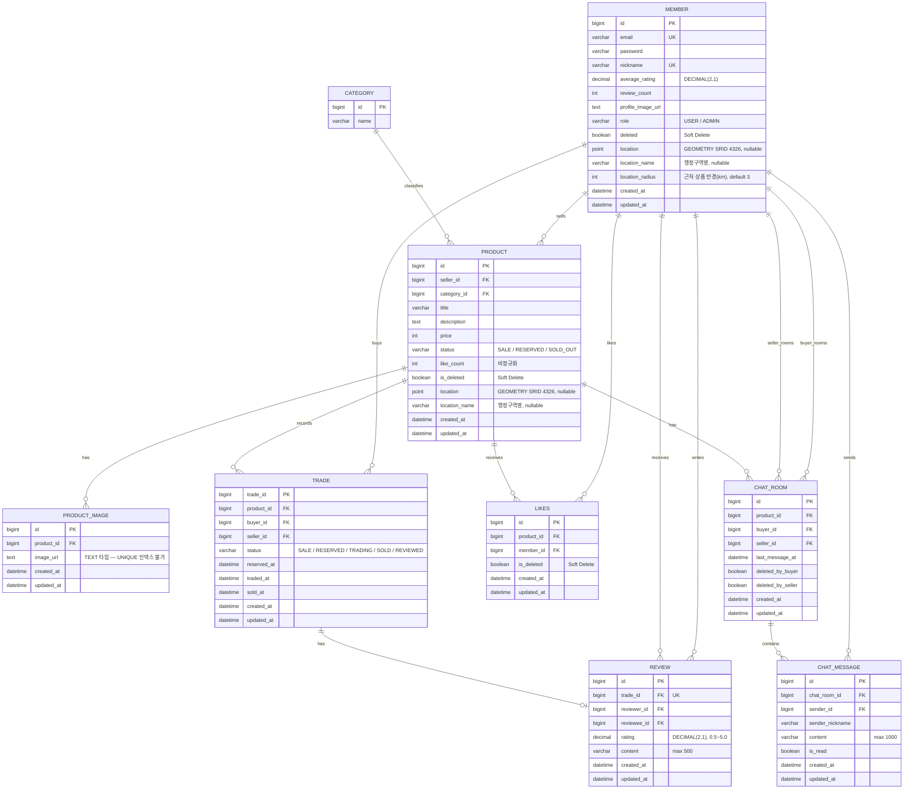

# 05. ERD (Entity Relationship Diagram)

> **버전**: v2.1 (MEMBER·PRODUCT 위치 컬럼 추가 / PRODUCT_IMAGE TEXT 타입 반영 / Lettuce 분산락 반영 및 찜 수 정책 수정)
> **표기법**: Mermaid ERD
>
> **개념 정의**: `PRODUCT` = 중고 판매글(Listing). 카탈로그 상품이 아님. 판매자가 올린 "이 물건을 팝니다" 게시글 1건 = PRODUCT 1건.

---

## 1. ERD

- PRODUCT는 일반 커머스 상품 마스터가 아니라 중고 판매글(Listing) 개념이다.
- PRODUCT.status는 판매글 공개 상태를 나타낸다.
- TRADE.status는 거래 진행 상태를 나타낸다.
- TRADE는 PRODUCT와 1:N 관계로 보며, 취소 후 재거래를 허용한다.
- REVIEW는 거래당 1건만 허용한다.
- CHAT_ROOM은 구매자가 상품 상세에서 채팅하기를 눌렀을 때 생성된다.
- 인기 검색어는 Redis Sorted Set으로 관리하며, DB 테이블 없음.
- MEMBER.location, PRODUCT.location은 JTS Point 객체로 저장 (SRID 4326, MySQL GEOMETRY 타입).
- MEMBER.location_radius 기본값 3km. 동네 인증 완료 후 근처 상품 조회가 활성화됨.
---

## 2. 설계 결정 사항

### 2-0. PRODUCT = 중고 판매글(Listing) 개념 명확화

PRODUCT는 상품 카탈로그(e-커머스의 SKU)가 아니다.
**판매자가 "이 물건을 팝니다"라고 올린 게시글 1건 = PRODUCT 1건**이다.

- 같은 모델의 아이폰을 2대 팔려면 → PRODUCT 2건 등록
- PRODUCT가 삭제(is_deleted=true)되면 해당 판매글이 비공개 처리됨
- PRODUCT.status는 "판매글의 공개/거래 상태", TRADE.status는 "실제 거래 진행 상태"로 역할이 다름

---

### 2-1. PRODUCT.status vs TRADE.status 역할 분리

| 상태 컬럼 | 역할 | 값 |
|-----------|------|-----|
| `PRODUCT.status` | 판매글 공개 상태 — 목록 노출 여부 제어 | `SALE` / `RESERVED` / `SOLD_OUT` |
| `TRADE.status` | 거래 진행 상태 — 거래 이력 관리 | `SALE` / `RESERVED` / `TRADING` / `SOLD` / `REVIEWED` |

**상태 전이 흐름**:
```
TRADE.status:  SALE → RESERVED → TRADING → SOLD → REVIEWED
                      ↑ (cancel) ↓    ↑ (cancel) ↓
                        SALE              SALE

PRODUCT.status: SALE ←→ RESERVED → SOLD_OUT
```

**왜 두 곳에 상태가 있는가?**
- PRODUCT.status가 없으면 목록 조회 시 매번 TRADE JOIN 필요 → 성능 저하
- TRADE.status가 없으면 취소 이력, 리뷰 연결 기준점 없음

**PRODUCT.status ↔ TRADE.status 동기화 규칙** (부분 동기화):

| TRADE.status | PRODUCT.status | 비고 |
|---|---|---|
| RESERVED | RESERVED | 예약 시 동기화 |
| TRADING | **RESERVED 유지** | PRODUCT에 TRADING 상태 없음 |
| SOLD | SOLD_OUT | 거래 완료 시 동기화 |
| REVIEWED | SOLD_OUT 유지 | PRODUCT 변경 없음 |

> 프론트는 상품 상세/홈에서 PRODUCT.status를 보고, 구매/판매 목록에서 TRADE.status를 별도로 받아 표시한다.

**거래 상태 전이 권한**:

| 전이 | 권한 |
|------|------|
| SALE → RESERVED | **구매자** (예약하기) |
| RESERVED → TRADING | **판매자**만 (거래 확정) |
| TRADING → SOLD | **구매자**만 (거래 완료 확인) |
| RESERVED/TRADING → SALE (취소) | 판매자, 구매자 모두 가능 |
| SOLD → REVIEWED | **구매자** (리뷰 작성) |

---

### 2-2. TRADE.product_id — UK 제거 이유

**이전 설계의 버그**: `product_id FK UK`로 설정하면 취소 후 재거래 불가능.

**현재 설계**:
- TRADE.product_id에 UK 없음 → 1개 상품에 여러 TRADE 레코드 가능
- 활성 거래 유일성은 **서비스 레이어**에서 보장:
```java
// 예약 시도 시 활성 거래 존재 여부 확인
boolean hasActiveTrade = tradeRepository
    .existsByProductIdAndStatusIn(productId,
        List.of(TradeStatus.RESERVED, TradeStatus.TRADING));
if (hasActiveTrade) throw new ConflictException("ALREADY_RESERVED", ...);
```
- DB 최후 방어선: `(product_id, status)` 복합 인덱스로 활성 거래 조회 최적화

---

### 2-3. 채팅방 생성 정책

**정책: 예약 전 자유 채팅 허용**

- 구매자가 상품 상세에서 [채팅하기] 클릭 → 채팅방 생성 (`POST /chat-rooms`)
- 같은 (buyer_id, product_id) 조합의 채팅방이 이미 있으면 기존 채팅방으로 진입 (중복 생성 방지)
- 예약은 채팅방 내 [예약하기] 버튼 또는 상품 상세에서 직접 가능

**왜 예약 전 채팅을 허용하는가?**
실제 중고거래에서 "아직 판매 중인가요?", "직거래 가능한가요?" 확인 없이 예약 버튼부터 누르는 사람은 없다. 채팅을 예약 이후로 제한하면 UX가 현실과 맞지 않는다.

**채팅방 나가기**: 양측 독립적 Soft Delete (`deleted_by_buyer`, `deleted_by_seller`)로 구현. 상대방이 메시지를 보내면 자동 재진입.

---

### 2-4. TRADE 테이블 분리 이유

상품(PRODUCT)과 거래(TRADE)를 분리한 이유:
- 취소 후 재판매: PRODUCT.status = SALE로 되돌리고 새 TRADE 생성 가능
- 거래 이력 보존: 분쟁 대비, 리뷰 기준점
- 리뷰가 trade_id 기준 → "이 거래의 구매자만 리뷰 작성 가능" 검증

---

### 2-5. LIKES.like_count 비정규화

- PRODUCT 테이블에 `like_count` 컬럼을 두어 목록 조회 시 JOIN 없이 찜 수 표시
- 정합성 허용 오차 ±1 수준 (실시간 정확도 불필요)
- **구현 정책**: `product.incrementLikeCount()` / `decrementLikeCount()` 호출을 통한 **Dirty Checking** 방식 채택.
- **동시성 보장**: JPA Dirty Checking은 갱신 손실(Lost Update) 위험이 있으나, 본 프로젝트는 `LikeFacade`에서 **Lettuce 분산락(Redis)**을 사용하여 상품 단위의 원자적 연산을 보장함.
- **LIKES Soft Delete**: `@SQLDelete`로 DELETE 시 `is_deleted = true`로 변경, `@Where(clause = "is_deleted = false")`로 조회 필터링. 재찜 시 `restore()`로 `is_deleted = false` 복원
- **동시성 제어**: `LikeFacade`에서 Lettuce 분산락으로 중복 찜/취소 방지 및 정합성 확보.

### 2-5-1. MEMBER.review_count 비정규화

- MEMBER 테이블에 `review_count` 컬럼을 두어 마이페이지 조회 시 COUNT 쿼리 불필요
- `average_rating`과 동일한 패턴: 리뷰 작성 시 단일 트랜잭션 내에서 함께 UPDATE
- `review_count`, `average_rating`도 목록/프로필 정합성을 위해 JPQL 벌크 UPDATE 또는 원자적 UPDATE SQL 패턴으로 통일
- 수정/삭제 불가 정책이므로 감소 로직 불필요

---

### 2-6. CATEGORY 단층(Flat) 구조

- 대분류/소분류 계층 없이 단일 카테고리 목록으로 구성
- `parent_id`, `depth` 컬럼 없음 — 자기 참조 관계 없음
- PRODUCT는 단일 `category_id`만 참조
- 3주 일정 내 계층 탐색 구현 복잡도를 제거하기 위한 결정

---

### 2-7. CHAT_MESSAGE 저장소

- Redis Pub/Sub이 아닌 MySQL 영속 저장
- 이유: 재연결 시 이전 메시지 조회, 거래 증거 보존
- 인덱스: `(chat_room_id, id DESC)` — 최신 메시지 빠른 조회
- `sender_nickname` 비정규화: 메시지 조회 시 Member JOIN 제거

---

### 2-8. 인기 검색어 설계 (Redis 기반)

- **Redis Sorted Set** (`search:popular:keywords`)을 사용하여 검색어 점수를 실시간 관리
- 검색 요청마다 `ZINCRBY` 명령으로 해당 키워드 점수 +1
- 스케줄러 + Caffeine 캐시로 TOP 10 인기 검색어 주기적 갱신
- DB 테이블(KEYWORD_LOG) 없이 Redis만으로 처리 — 쓰기 부하 최소화

---

### 2-9. 위치 데이터 설계

**컬럼 구성**:

| 테이블 | 컬럼 | 타입 | 설명 |
|--------|------|------|------|
| MEMBER | `location` | GEOMETRY (POINT, SRID 4326) | 동네 인증된 GPS 좌표. nullable — 인증 전 null |
| MEMBER | `location_name` | VARCHAR | 카카오 API 반환 행정구역명 (예: "마포구 합정동") |
| MEMBER | `location_radius` | INT | 근처 상품 조회 반경(km). default 3 |
| PRODUCT | `location` | GEOMETRY (POINT, SRID 4326) | 상품 등록 시 판매자 인증 위치 저장. nullable |
| PRODUCT | `location_name` | VARCHAR | 상품 등록 위치 행정구역명 |

**좌표 저장 방식**:
- Java: `org.locationtech.jts.geom.Point` (Hibernate Spatial 매핑)
- `GeometryFactory(PrecisionModel(), 4326)` 사용
- `Coordinate(lng, lat)` 순서 (JTS 관례: x=경도, y=위도)

**근처 상품 조회 쿼리 핵심**:
```sql
ST_Distance_Sphere(product.location, ST_GeomFromText('POINT(lng lat)', 4326)) <= member.location_radius * 1000
-- ST_GeomFromText 사용 이유: ST_Point(lng, lat, srid)는 MySQL 8.0.24+ 전용
-- 단위: ST_Distance_Sphere 결과는 미터(m) → location_radius * 1000으로 변환
```

---

## 3. 인덱스 계획 (EXPLAIN 기반 최적화 대상)

| 테이블 | 인덱스 | 이유 |
|--------|--------|------|
| PRODUCT | `(status, created_at DESC)` | 목록 조회 기본 정렬 |
| PRODUCT | `(category_id, status)` | 카테고리 필터 검색 |
| PRODUCT | `(seller_id)` | 내 판매 목록 |
| PRODUCT | `FULLTEXT(title)` | 키워드 검색 (LIKE → FULLTEXT ngram) |
| TRADE | `(product_id, status)` | 활성 거래 존재 여부 확인 (UK 대체) |
| TRADE | `(buyer_id)` | 구매 이력 조회 |
| LIKES | `UNIQUE(product_id, member_id)` | 중복 방지 + 찜 여부 조회 |
| CHAT_ROOM | `UNIQUE(buyer_id, product_id)` | 동일 채팅방 중복 생성 방지 |
| CHAT_ROOM | `(seller_id)` | 판매자 기준 채팅방 목록 조회 최적화 |
| CHAT_MESSAGE | `(chat_room_id, id DESC)` | 채팅 이력 최신순 |
| REVIEW | `(reviewee_id, id)` | 받은 리뷰 목록 조회 |
| PRODUCT | `SPATIAL(location)` | 근처 상품 `ST_Distance_Sphere` 반경 조회 최적화 |
| MEMBER | `SPATIAL(location)` | 회원 위치 조회 (필요 시) |
